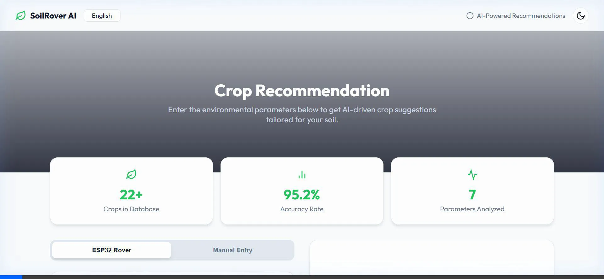

# SoilRover AI: Soil Quality Surveying Rover with AI Crop Recommendation



SoilRover AI is a comprehensive solution designed to empower farmers and agricultural enthusiasts with real-time soil data and intelligent crop recommendations. The system uses an ESP32-based rover equipped with sensors to collect soil parameters and a web-based dashboard for visualization and AI-driven analysis.

## 🚀 Key Features

- **Real-time Monitoring**: Live tracking of soil temperature, moisture, NPK levels, and pH.
- **AI Crop Recommendation**: High-accuracy (95.2%) machine learning model for intelligent crop suggestions.
- **Universal Accessibility**: Multi-language support (English, Hindi, Telugu, Tamil, Kannada, Marathi, Punjabi).
- **Offline-First Ready**: Integrated Service Workers and Web Workers for low-latency, offline-capable ML predictions.
- **Dual Mode Connectivity**: Supports both Serial (USB) and Blynk Cloud data bridging.
- **Modern UI**: Premium Glassmorphism design with Dark/Light mode support.

## 🛠️ Tech Stack

- **Frontend**: HTML5, CSS3 (Vanilla), JavaScript (ES6+), Google Fonts.
- **Backend**: Node.js, WebSocket (WS), SerialPort.
- **Edge ML**: Web Workers for local model execution.
- **Hardware**: ESP32, Soil Sensors (Temperature, Moisture, NPK, pH).

## 📂 Project Structure

- `index.html` - Main UI dashboard.
- `style.css` - Custom premium styling.
- `script.js` - Frontend logic and WebSocket client.
- `server.js` - Node.js bridge server (Serial/Blynk to WebSocket).
- `worker.js` - Web Worker for ML calculations.
- `sw.js` - Service Worker for offline capabilities.
- `soilsensor_local.ino` - ESP32 firmware for local data collection.
- `package.json` - Server dependencies and scripts.

## ⚙️ Setup Instructions

### 1. Hardware Setup
- Connect your ESP32 to the soil sensors.
- Flash the `soilsensor_local.ino` sketch using the Arduino IDE.

### 2. Software Installation
```bash
# Clone the repository
git clone https://github.com/yourusername/soilrover-ai.git
cd soilrover-ai

# Install dependencies
npm install
```

### 3. Running the Application
```bash
# Start the bridge server
npm start

# Access the UI
# Open http://localhost:3000 in your browser
```

## 📜 License

This project is licensed under the MIT License - see the [LICENSE](LICENSE) file for details.

## 🙏 Acknowledgments
- Inspired by modern agricultural tech trends.
- Powered by Google DeepMind Antigravity AI.
